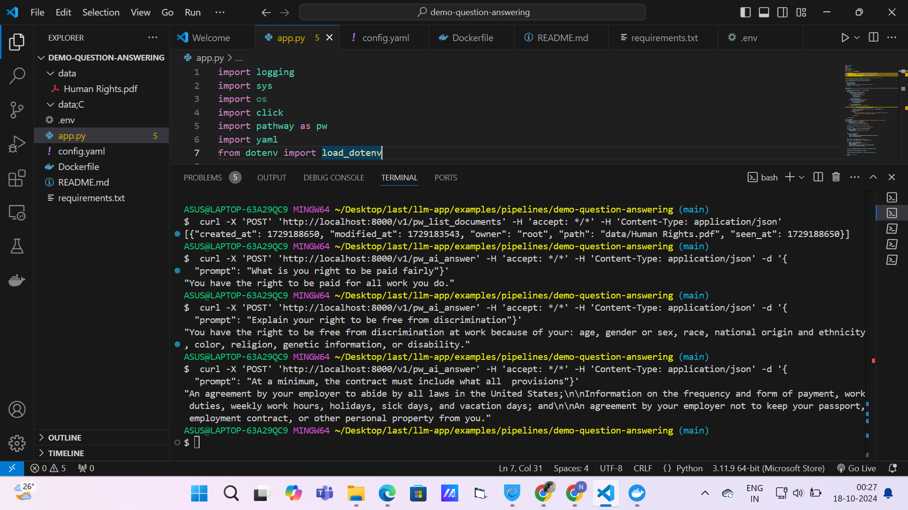

# 🌟 RightsReach LLM-Based Human Rights Query Answering System 🌟

RightsReach: A streamlined application designed to answer legal rights-related questions using large language models (LLMs). It employs a Retrieval-Augmented Generation (RAG) approach to extract relevant information from legal documents and generate precise answers to user queries, ensuring reliable and clear legal insights.
## 📷 Screenshots
Here’s a screenshot of the application in action:



## 🌟 Features
- 🗂️ **Document Management**: Effortlessly manage and view all available documents.
- 🔍 **Intuitive Search**: Quickly find relevant information to answer legal queries.
- ☁️ **Cloud and Local Storage**: Supports documents stored locally as well as on cloud platforms like Google Drive.
- ⚡ **Rapid Answers**: Provides swift and accurate responses to user inquiries using an LLM.
- 📖 **Enhanced Retrieval-Augmented Generation (RAG)**: Combines efficient document retrieval with advanced language generation powered by Google Gemini to deliver precise answers to questions.

## 🛠️ Installation

### Prerequisites
- Docker
- Python 3.11+

### Clone the Repository
To get started, clone the repository to your local machine:


### Setup Instructions

1. **Install Docker**: Ensure Docker is installed and running on your machine. You can find installation instructions on the [Docker website](https://docs.docker.com/get-docker/).

2. **Install Dependencies**: Install all the required Python dependencies by running:

   ```bash
   pip install -r requirements.txt

3. **Run the Application:**:Use Docker to run the application:

   ```bash
   docker-compose up

## ⚖️ License
This project is licensed under the MIT License. For more details, please refer to the [LICENSE](LICENSE) file.

## 🤝 Contributing
We welcome contributions! If you have suggestions for improvements, please feel free to submit a pull request or raise an issue. Your feedback and input are highly appreciated!
   
   

